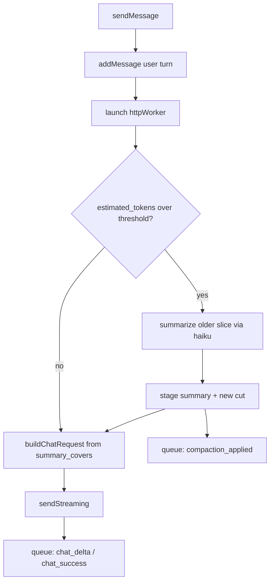

# Chat Compaction & Session Persistence

This document captures research into industry-standard approaches to chat
context compaction, and proposes a design for bringing compaction — and the
on-disk session log it pairs naturally with — to chat-zig.

> **Both halves have since shipped.** The document is kept in its original
> proposal form, with "Status" and "Implementation note" callouts marking
> what landed and where the code diverged, because the reasoning behind the
> shape is worth more than a description of the shape. Read §"The core
> simplification" first: everything else follows from it.

## Background: how chat-zig worked before this

`AppState.buildChatRequest` (`src/state.zig:629`) snapshotted the _entire_
`messages` ring buffer into every request — no truncation, no summarization,
no token accounting. `messages` is capped at `MAX_MESSAGES = 256` with
`MAX_MESSAGE_LEN = 32768` chars each, so a long session would eventually blow
past Claude's context window (or just get very expensive) with no warning.

Two existing behaviors matter for this design:

- **The ring already silently drops history.** `addMessage`
  (`src/state.zig:547`) overwrites the oldest message once `message_count`
  hits `MAX_MESSAGES`, with no marker and no durable copy. That was
  unannounced context loss, independent of compaction — fixed by the
  session log, which keeps a durable copy of every turn regardless.
- **`.system` messages are excluded from requests.** `buildChatRequest` does
  `.system => continue`, because Anthropic takes the system instruction via a
  separate top-level field. Anything stored in `messages` with that role is
  invisible to the model.

## Industry-standard patterns

There isn't one single "standard," but the field has converged on a small set
of techniques, layered together.

**Track a token budget, not a message count.** Every serious implementation
measures context in tokens against the model's window. Anthropic's Messages
API returns `usage.input_tokens` / `usage.output_tokens` on every response,
and there's a `POST /v1/messages/count_tokens` endpoint to estimate cost
before sending. Anthropic's context-window docs recommend triggering context
management proactively, well before the hard limit — quality degrades
("context rot") as you approach it, not just at the boundary.

**Compaction = summarize-and-replace, not just truncate.** The dominant
pattern (Claude Code's `/compact`, ChatGPT's rolling summarization,
LangChain's `ConversationSummaryBufferMemory`, Anthropic's server-side
Compaction beta) keeps the most recent K turns verbatim, asks a cheap model to
compress everything older into a dense summary — key facts, decisions, open
threads — and sends that summary in place of the old turns.

**Trigger proactively on a ratio.** Common thresholds are 70–90% of the
window. Reacting only after a 400 "prompt too long" is treated as a bug.

**Be transparent.** Users get a visible marker so they know older detail was
condensed and can ask follow-ups if the assistant seems to have forgotten
something.

## The core simplification: compaction is derived, not destructive

The obvious implementation — splice the summary into `messages` and delete the
old entries — is the wrong shape for this codebase. `messages` is a ring
buffer with a moving `message_head`, so "splice" means wrap-aware element
moves; and every logical index the UI holds (`streaming_message_idx`, each
`cached_height`, `list_state`'s item count) would be invalidated by the shift.

Instead: **never mutate `messages`.** Treat the ring as the UI transcript and
the summary as a small derived cache that only affects _request assembly_.

```zig
// Compaction state — a derived view, not a mutation of history.
summary_buf: [MAX_SUMMARY_LEN]u8 = undefined,
summary_len: usize = 0,
/// Value of `messages_total` at the compaction cut: the summary covers
/// every message added before this point.
summary_covers: u64 = 0,
```

`buildChatRequest` then starts its loop at the cut instead of at zero, and
passes the summary through the `system` field that `ChatRequest` already has.
That is the entire mechanism. It buys:

- No ring surgery, no wraparound edge cases, no `@memmove`.
- `streaming_message_idx`, `cached_height`, and `list_state` are untouched.
- No new `MessageRole`, and no risk of the `.system => continue` trap.
- Compaction is idempotent and re-runnable — recompacting is just recomputing
  a summary and advancing `summary_covers`.
- Failure is free: leave `summary_len` alone and the next request is simply
  the uncompacted one.

### Locating the cut across ring overflow

Logical indices decay: once the ring overwrites, `getMessage(0)` refers to a
different message than it did before. So the cut is stored against a
monotonic counter, not a logical index.

```zig
messages_total: u64 = 0, // incremented by every addMessage, never wraps
```

```zig
const evicted = self.messages_total - self.message_count;
const start: usize = if (self.summary_covers > evicted)
    @intCast(self.summary_covers - evicted)
else
    0; // The ring already dropped everything the summary covers.
std.debug.assert(start <= self.message_count);
```

`messages_total` does double duty as the sequence number for the on-disk log
(below), so it is not a field that exists only for compaction.

### The cut must land on a user turn

Anthropic requires the first message in `messages` to have role `user`. After
snapping `start` forward to the next `.user` message, that holds by
construction. This is the one constraint the summary cannot paper over, and
it is why the summary lives in `system` rather than as a synthetic leading
message — a synthetic `user` message would collide with the retained slice's
own leading `user` turn.

## Proposed design

> **Status: implemented.** Live in `src/compaction.zig` (tuning constants,
> prompts, and the cut arithmetic — primitives only, so `zig build test`
> covers it without pulling gooey in) and `src/state.zig` (`runCompaction`,
> `planCompactionCut`, `retainedStart`, `buildSummaryRequest`,
> `applyCompactionApplied`). See the "Implementation notes" callouts inline
> below for where the shipped code diverges from this sketch.



### 1. One fiber, not two

Because compaction no longer mutates UI state, it does not need a round trip
to the main thread before the chat request can proceed. `httpWorker` checks
the budget and, if over, performs the summarization request synchronously as
its first step, then builds the real request from its own staged summary.

This means: **no `is_compacting` flag, no second entry point into "launch
httpWorker," no re-entrancy.** `is_loading` already means "a send is in
flight," which is exactly true during compaction, and `cancelInFlight`'s
existing `pending_request` handling covers both phases unchanged.

The worker still publishes the result through the queue so the main thread
owns the live fields:

```zig
pub const CompactionResult = struct {
    summary_len: u32,
    covers: u64,
};
// added to WorkerResult:
compaction_applied: CompactionResult,
```

The worker writes `pending_summary_buf` / `pending_summary_len` and uses that
copy locally for the current request; `applyCompactionApplied` copies it into
`summary_buf` / `summary_len` / `summary_covers` on the main thread. Same
staging pattern as `pending_response_buf` today.

> **Implementation note:** "uses that copy locally" is expressed as a
> `CompactionView { summary, covers }` that `runCompaction` returns and the
> request builders take as a parameter, rather than as a read of
> `summary_*`. Making the view an explicit argument is what lets the worker
> use a summary the main thread has not adopted yet without either side
> needing to know the other's timing.
>
> `buildOpenAIChatRequest` takes the view too. Compaction only _runs_ on
> the Anthropic path (summarization goes through haiku, on a client the
> OpenAI worker doesn't have), but a summary earned there shouldn't be
> discarded because the user switched models mid-conversation.

### 2. Constants

```zig
const COMPACTION_TRIGGER_RATIO: f32 = 0.75;
const COMPACTION_KEEP_RECENT: usize = 8;  // recent messages kept verbatim
pub const MAX_SUMMARY_LEN = 4096;         // ~1k tokens; compression is the point
```

`MAX_SUMMARY_LEN` is deliberately far below `MAX_MESSAGE_LEN` — a summary
allowed to be 32 KB is not a summary. The summarization prompt asks for under
400 words and the result is truncated to fit.

`Model` gains `contextWindowTokens() u32` alongside the existing `apiName()`.
Note `anthropic.zig` already has a `MAX_TOKENS` meaning the _output_ cap;
keep these visibly distinct (`context_window_tokens` vs `max_output_tokens`)
so the two never get confused at a call site.

> **Implementation note:** the constants live in `src/compaction.zig` as
> `TRIGGER_RATIO`, `KEEP_RECENT`, `MAX_SUMMARY_LEN`, and `CHARS_PER_TOKEN`,
> alongside the cut arithmetic they parameterize, rather than in
> `state.zig`. That module takes primitives and returns primitives — no
> `AppState`, no `std.Io`, no gooey — which is what lets `cutToIndex`,
> `proposedCovers`, and `utf8SafeLen` be unit-tested (`compaction-tests` in
> `build.zig`) instead of being exercised only by running the app. The
> off-by-one-prone half of the feature is precisely the seq→index
> translation, so it is the half worth testing.
>
> `Model.context_window_tokens` shipped as a parallel array next to
> `display_names` / `api_names` / `providers`, keeping the "adding a model
> means updating all of these" property visible, with a matching `comptime`
> length assertion.
>
> One constant the sketch didn't anticipate: the summary is truncated to
> `MAX_SUMMARY_LEN` on a **UTF-8 boundary** (`compaction.utf8SafeLen`).
> Cutting mid-codepoint would put invalid UTF-8 into a JSON string —
> `writeJsonEscapedString` passes non-control bytes through verbatim — and
> the API answers that with a 400, in both the request body and the
> session log.

### 3. Token estimation: heuristic only, for v1

`estimated_tokens: u32` on `AppState`, recomputed as
`(total_chars + attachment_bytes) / 4`.

Deliberately **not** using real `usage` numbers in v1. On the streaming path —
the only path `httpWorker` uses (`src/state.zig:860`) — `usage` arrives in the
`message_start` and `message_delta` SSE events, both of which
`parseSseTextDelta` explicitly discards (`anthropic.zig:1211`). Wiring it up
means extending `SseEvent` and the `StreamSink` contract, which is the
largest piece of work in the whole proposal and buys very little: this is a
threshold, not a bill. Being 30% off means compacting at 65% or 85% instead
of 75%. Defer it.

What _cannot_ be deferred is counting attachments. Files go through
`sendStreamingWithFile` and are inlined into the request by the client — they
never appear in `messages`, and a single attached file dwarfs the entire text
history. Add the staged file's byte length to the estimate at send time, or
the estimator is blind to the most likely cause of overflow.

### 4. Summarize with haiku

Not an open question: the model is per-request (`ChatRequest.model`) and
`AnthropicClient` is model-agnostic, so passing `Model.haiku.apiName()` is a
one-line change with no structural cost and matches industry practice.

> **Implementation note:** two details the sketch left open, both forced by
> Anthropic's message-shape rules:
>
> - The summarization request ends with an extra `.user` turn carrying
>   `compaction.REQUEST`, because the slice being summarized ends wherever
>   the cut fell and the model needs to be told what to do with it.
> - Any **prior** summary leads that request as its own `.user` turn, so a
>   second compaction subsumes the first rather than dropping it.
>   `compaction.SYSTEM_INSTRUCTION` tells the model to expect a transcript
>   that may open with a summary.
>
> On the _chat_ request, the summary can't simply become `system` — that
> would drop `CHAT_SYSTEM_INSTRUCTION` and silently turn Markdown back on
> the moment a conversation got long enough to compact.
> `composeSystemInstruction` concatenates the two into a buffer whose
> length is derived from both operands, so it cannot overflow, and which
> lives on the request's `ChatMessagesBuffer` so it shares exactly the
> lifetime of the message slices beside it.

### 5. Assertions and progress

- `assert(start <= message_count)` after converting the cut to a logical index.
- `assert(summary_len <= MAX_SUMMARY_LEN)` before staging.
- `assert(new_covers > summary_covers)` — compaction must make progress. If a
  summarization would not advance the cut, skip it rather than looping.
- Guard re-triggering: do not compact again until at least
  `COMPACTION_KEEP_RECENT` messages have been added since `summary_covers`.
  Without this, a long retained tail can leave you over threshold immediately
  and compact on every single turn.

> **Implementation note:** the progress guard is `planCompactionCut`, which
> returns null — skipping the summarization request entirely — unless both
> `proposedCovers() > summary_covers` and the snapped retained-start index
> actually moves. Returning null rather than asserting is deliberate: this
> is a reachable steady state (a conversation whose newest `KEEP_RECENT`
> messages alone exceed the threshold), not a bug, and the assertion the
> sketch wanted now lives on the far side of the queue in
> `applyCompactionApplied` (`assert(r.covers > self.summary_covers)`) where
> it genuinely cannot fire.

### 6. Surface it in the UI

A banner above the composer — "history compacted · N earlier messages
summarized" — driven by `summary_covers`. No message-list surgery, no
synthetic bubble, no virtual-list changes. Since the ring keeps every message
and the disk log keeps them durably, scrolling up still shows real history;
the banner explains that older turns are being sent in condensed form. A
divider row rendered at the cut is a nice later refinement, not v1.

> **Implementation note:** shipped as the first child of `InputArea`'s
> column, above the error banner, with `Lucide.archive` at
> `t.text_secondary` — deliberately quieter than the red error banner it
> sits above, since compaction is routine rather than a problem.
>
> `AppState.compactionBanner` formats on demand into a state-owned buffer
> and returns null when `summary_len == 0`, rather than being refreshed at
> each write point. One source of truth (`summary_covers`), nothing to
> drift.

## Session persistence

> **Status: implemented**, including the `summary` line type, which landed
> with compaction. The mechanics below (format, write points, no line
> buffer, best-effort errors) are live in `src/session_log.zig`
> (`SessionLog`) and wired into `src/state.zig`. See the "Implementation
> notes" callouts inline below for where the shipped code diverges from the
> original sketch.

Flushing chats to disk is worth doing on its own merits, and it makes
compaction meaningfully safer: the summary becomes a lossy _transport_
optimization rather than the only surviving record. It also fixes the
pre-existing silent ring-overflow data loss noted at the top.

### Format and location

Mirror `RecordingState.preparePath` (`src/state.zig:113`), which already
establishes the idiom — `std.Io.Dir.cwd().createDirPath(io, ...)` plus a
timestamp-named file:

```
sessions/{unix_seconds}.jsonl
```

One JSON object per line, append-only:

```json
{"seq":0,"role":"user","text":"...","file":"notes.txt"}
{"seq":1,"role":"assistant","text":"..."}
{"seq":8,"type":"summary","covers":8,"text":"..."}
```

`seq` is `messages_total` at the time of the write — the same counter
compaction uses, so the summary line's `covers` is directly comparable and a
restored session does not have to re-pay for summarization.

> **Implementation note:** `AppState.addMessage` now returns the `seq` it
> assigns (the pre-increment value of `messages_total`), so every call site
> that adds a message gets its `seq` for free without a second lookup. The
> streaming path additionally carries a `streaming_message_seq: ?u64` field
> alongside the existing `streaming_message_idx`, since the log write for a
> streamed assistant turn happens once the stream finishes — well after
> `addMessage` was called on the first delta.

### Write points

- **User turn**: in `sendMessage`, right after `addMessage`. ✅ implemented.
- **Assistant turn**: in `applyChatSuccess` / `applyChatError`, once the
  message is final. Explicitly _not_ per delta — `applyChatDelta` fires
  continuously during streaming, and appending there would rewrite the whole
  message on every chunk. ✅ implemented, including the error path: a partial
  assistant message (some deltas arrived before the request failed) is still
  logged, since from the log's perspective the turn is final either way.
- **Summary**: in `applyCompactionApplied`. ✅ implemented, via
  `SessionLog.logSummary`. `seq` is `messages_total` at the moment the
  summary was adopted, so the line sorts into the transcript where
  compaction actually happened, while `covers` names the cut it stands in
  for — the two are different numbers, `KEEP_RECENT` apart.

All three are main-thread, bounded (≤ `MAX_MESSAGE_LEN`), and happen at human
turn rate, so a blocking write is fine. If it ever shows up in a frame trace,
move it to the worker fiber — but don't pre-optimize it there, because that
would reintroduce the cross-thread ownership question this design just spent
its budget eliminating.

### No line buffer

Escaping worst case is ~6× (`\u00XX` per byte), so a `MAX_MESSAGE_LEN` message
could need a ~200 KB line buffer. Don't allocate one — stream directly to the
file through an `Io.Writer` with a small fixed buffer, reusing
`writeJsonEscapedString` from `anthropic.zig`, which already exists and is
already tested. Zero new dependency, zero new escaping logic.

> **Implementation note:** `SessionLog.writeLineIn` uses a 256-byte fixed
> buffer (`LINE_BUFFER_LEN`) per write, in `.streaming` mode against a
> `File` handle kept open for the process's lifetime — appends fall out of
> the OS-tracked fd cursor rather than any explicit offset bookkeeping, so
> reopening per write was never necessary.

### Errors

A failed session write must never block a send. Log it and set a one-shot
`session_write_failed: bool` for a subtle indicator. The chat is still fully
functional without its log.

> **Implementation note:** shipped as `SessionLog.write_failed` (on the
> `session_log` field, not a top-level `AppState` bool) plus a `log.warn` at
> the point of failure. There is no UI indicator wired up yet — the doc's
> "subtle indicator" is still just the log line. A banner or icon reading
> `state.session_log.write_failed` would be a small follow-up.

### Restore

> **Status: implemented.** Clicking a row in `HistoryPanel` calls
> `AppState.loadSession`, which cancels any in-flight request, clears the
> ring, replays the session's `sessions/{unix_seconds}.jsonl` file via
> `session_log.loadSessionLines` (one callback per recognized message
> line, oldest first), and restores `messages_total` from the highest
> `seq` seen. `addMessage`'s existing ring-overflow eviction naturally
> keeps only the newest `MAX_MESSAGES` of a longer session, matching the
> original sketch below.
>
> Restoring does **not** reopen or rewrite the restored session's own
> file — the current process's `SessionLog` (already pinned to this
> launch's file, or not yet opened) keeps writing where it left off. Any
> turn sent after a restore is appended there, continuing from the
> restored `messages_total`, so seq numbers stay globally increasing even
> though they now span two files.
>
> `summary_*` restoration is implemented: `LoadedLine` became a
> `union(enum) { message, summary }`, and `loadSession`'s callback adopts
> the last summary line the file contains. Later summaries subsume earlier
> ones (each is computed from its predecessor — see `buildSummaryRequest`),
> so plain assignment in file order lands on the right cut.
>
> One wrinkle falls out of the per-launch file design: a restored
> `summary_covers` is a `seq` in _that file's_ numbering, while
> `messages_total` keeps counting in this process's. The two coincide when
> restoring into a session that hasn't sent anything yet — the common case,
> and the one where the cut lands exactly right. Otherwise the process is
> already `base` messages ahead and `cutToIndex` resolves the cut `base`
> messages too early, so a few turns get sent verbatim that the summary
> already covers. That is redundant, never lossy, and costs a handful of
> messages rather than the machinery to translate between two seq spaces.
> A cut landing past the end of the transcript (only reachable via a
> truncated or hand-edited file) _would_ clamp real history away, so the
> summary is dropped outright in that case.

The format was chosen so this falls out cheaply: read the message lines
into the ring, restore `messages_total` from the highest `seq`, and restore
`summary_*` from the last summary line.

### New conversation

> **Status: implemented, not currently exposed.** `AppState.newConversation`
> cancels any in-flight request, clears the ring, and calls
> `SessionLog.startNew` — closing the current on-disk file (if one was
> opened) and resetting `SessionLog` to its pre-first-write state so the
> next turn lazily opens a brand new `sessions/{unix_seconds}.jsonl` file.
> `messages_total` resets to 0, since (unlike a restore) there's no
> surviving transcript whose `seq` numbers could collide — the old file is
> left exactly as it was on disk, and still shows up in the history list.
>
> `newConversation` and `loadSession` both call `clearCompaction()` before
> replaying, since a `summary_covers` measured against a different
> transcript would silently truncate the new one's history.
>
> Previously reachable via a "New chat" button in `HistoryPanel`'s header;
> that button was removed once `HistoryToggle` started doubling as a
> "back to chat" control while the panel is open, leaving `newConversation`
> without a call site pending a new one (e.g. a keyboard shortcut).

## Failure behavior

If the summarization request itself fails, log it, leave `summary_*`
unchanged, and send the user's turn with whatever history is currently
retained. Best-effort — a compaction failure must not block the send. The
request may then 400 for length, which surfaces through the existing
`applyChatError` path with no new machinery.

## Open decisions

- **`KEEP_RECENT` and `TRIGGER_RATIO`** — shipped at 8 and 0.75. Still
  product calls; they now live at the top of `src/compaction.zig` where
  they're a one-line change.
- ~~**Attachments in the summarized slice**~~ **Decided: the fact, never
  the bytes.** `compaction.REQUEST` says so explicitly, and it falls out
  for free anyway — `Message` only ever stored the filename
  (`attached_file`), so the raw bytes were never in the ring to leak.
- **Real `usage` numbers instead of the `chars / 4` heuristic** — still
  deferred, for the reasons in §3. The place to start is `SseEvent` in
  `anthropic.zig`, which currently discards `message_start` and
  `message_delta`.
- **Compaction on the OpenAI path** — `buildOpenAIChatRequest` honors an
  existing summary but never produces one, so a conversation held entirely
  on GPT models never compacts. Fixing it means either summarizing with an
  OpenAI model or routing summarization to the Anthropic client regardless
  of the selected chat model; neither is obviously right, and neither is
  needed until someone hits it.
- ~~**One session file per app launch, or per conversation?**~~ **Decided:
  per launch.** `SessionLog` opens its one file lazily on the first write
  and never reopens; `clearMessages` does not touch it or `messages_total`.
  Per-conversation (new file on "New chat") remains a possible follow-up if
  that ever proves the wrong granularity in practice.

## References

- Anthropic docs: [Context windows](https://docs.claude.com/en/docs/build-with-claude/context-windows)
- Anthropic docs: [Token counting](https://docs.claude.com/en/docs/build-with-claude/token-counting)
- Anthropic docs: Compaction and Context editing (linked from the Context
  windows page's "Manage context with compaction" section)
